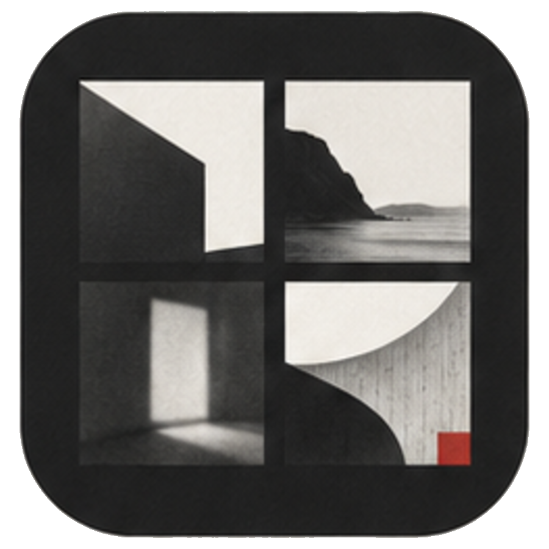
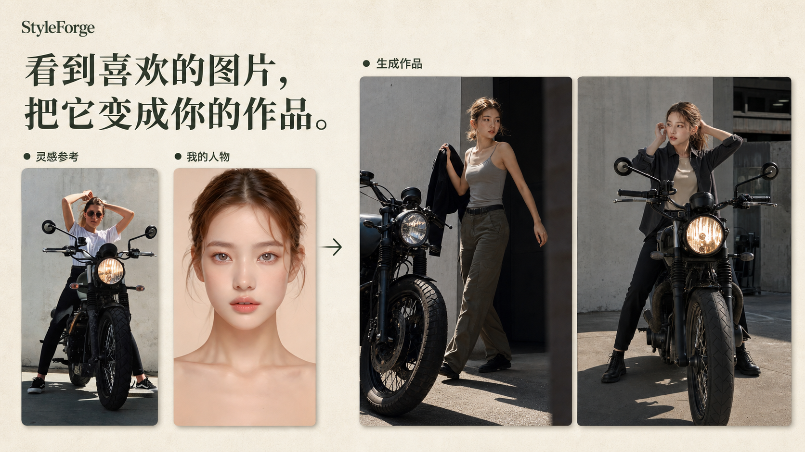
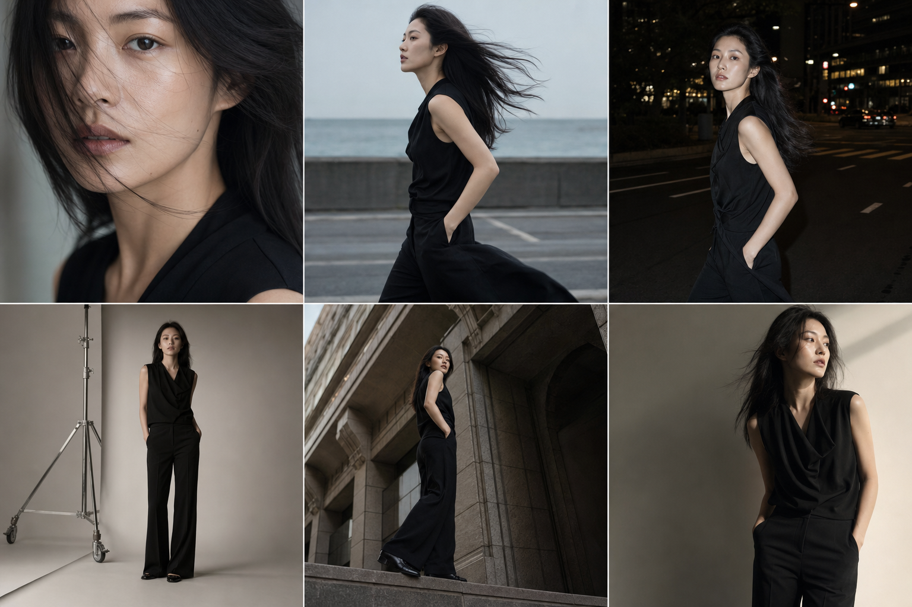
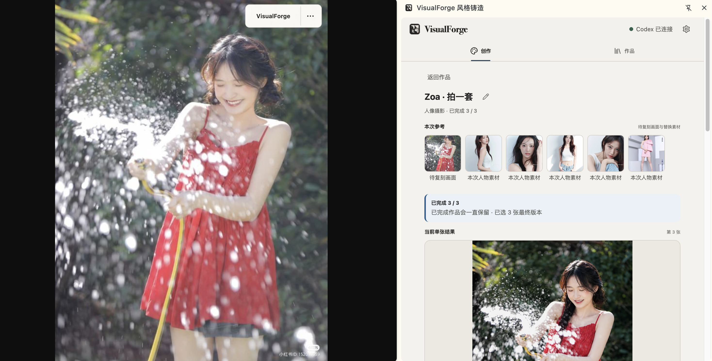
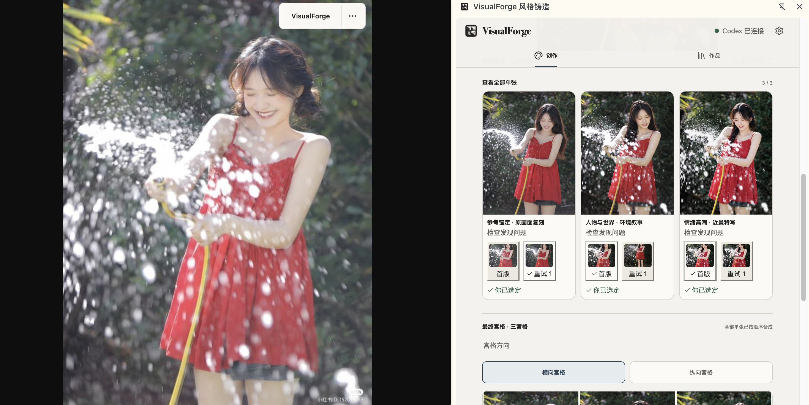

<div align="center">



# VisualForge

[简体中文](README.md) · **English**

### Turn images you love into work of your own.

[](LICENSE)
[](INSTALL.en.md)
[](https://github.com/dososo/visualforge/releases/latest)
[](https://github.com/dososo/visualforge/releases/latest)
[](#how-it-works)

[Download](https://github.com/dososo/visualforge/releases/latest) · [Three-step setup](#get-started-in-three-steps) · [Full install guide](INSTALL.en.md)

</div>

<div align="center">
  
  <br><sub><b>The reference controls how the image is made. Your assets control who or what appears.</b></sub>
</div>

VisualForge is a **Chrome side-panel extension** connected to your local Codex installation. Capture a portrait, photo, or product ad you like on the web; VisualForge understands its composition, action, lighting, color, material, and mood, then combines that visual method with your person or product references to create a single image, a photo set, or a grid.

## What VisualForge is

It has two parts:

- **Chrome side-panel extension** — captures references, presents the visual analysis, adds people or products, and manages results.
- **Local connector** — connects to your signed-in Codex installation for visual understanding and image generation. No separate API key is required.

VisualForge is not a filter and does not ask you to begin with a blank prompt. It starts with a visual you genuinely like: **understand why it works, then replace its subject with yours.**

## Who it is for

- **Creators** turning saved visual directions into covers, illustrations, and consistent series.
- **Photographers and models** translating one inspiration image into an executable shoot direction and complete photo set.
- **Brands, shops, and independent sellers** exploring ad compositions and material treatments with their own products.
- **Design and creative teams** turning “we want this feeling” into visible, revisable project records.
- **Everyday users** who want reference-driven creation without learning complex prompt writing.

## What it is useful for

The usual workflow means describing a style, repeatedly tuning prompts, organizing identity or product references, then manually trying to align composition and mood. VisualForge turns that work into one clear path:

> **Find a visual → understand the image → replace it with your person or product → generate and choose the final work.**

Its value is not random one-click output. It reduces briefing and trial-and-error while keeping the reference, subject assets, candidates, quality guidance, and final selection in one project.

## Core capabilities

| Capability | What VisualForge does | What you get |
| --- | --- | --- |
| Web and local references | Capture a web image directly, upload, or paste | Inspiration moves into the workflow without download-and-file chores |
| Reference understanding | Analyze composition, shot size, action, expression, light, color, material, and finish | An understandable creative method, not only a black-box prompt |
| Person or product replacement | Keep visual method and subject identity／structure as separate responsibilities | Your version without inheriting the person from the reference |
| Single, set, and grid output | Create one image or 2／3／4／6／9／12 shots, then compose grids locally | A hero image, a complete photo story, or a social grid |
| Per-image review and revision | Preserve candidates, quality guidance, targeted regeneration, and Final Selection | Fix one image without restarting the whole set |
| Local project management | Save projects, asset relationships, and generation records | Continue, inspect, and export without a VisualForge cloud account |

## Portrait and product style panorama

VisualForge does not treat style as a filter. Its current built-in system contains **48 original styles across 6 categories**, each defining executable rules for framing, viewpoint, space, light, color, material, action, and finishing. The table below lists all 16 styles dedicated to portraits and products. The other 32 styles cover cinematic narrative, contemporary Eastern visual language, editorial art, and lifestyle directions, and can also be recommended according to the reference and creative goal.

<div align="center">
  
  <br><sub><b>One person and one wardrobe system, developed through close-up, motion, night, studio, and architectural shots.</b></sub>
</div>

| Type | Style | What it is | Best for | Key controls |
| --- | --- | --- | --- | --- |
| Portrait | **Breathing Close Field**<br>呼吸近场 | Intimate portraiture built from close distance, real skin, and a gaze that does not perform for camera. | Emotional close-ups, profile covers, identity picks | Preserve identity, real skin, and an in-between breath; avoid skin smoothing, rigid eye contact, and hands covering features. |
| Portrait | **Wind Trace Profile**<br>风迹侧写 | A single wind direction shapes silhouette, clothing, and action while identity stays clear. | Outdoor portraits, dynamic fashion, story sets | Preserve wind direction, identity, and credible balance; avoid random flying elements, blurred faces, and static wind poses. |
| Portrait | **Night Walk Hard Flash**<br>夜行硬闪 | Mid-stride night frames combine near-axis hard flash with ambient light for accidental fashion energy. | Fashion, music portraits, night stories | Preserve mid-action timing and flash–ambient coexistence; avoid studio-black backgrounds, purple-blue neon, and eye contact in every shot. |
| Portrait | **Low Voice Studio**<br>低声棚景 | Studio equipment and production traces remain visible while quiet, purposeful actions build an environmental portrait. | Fashion editorials, actor portraits, series identifiers | Preserve the person–studio relationship; avoid ID-photo backdrops, equipment clutter, and actions without a task. |
| Portrait | **Oblique Disclosure**<br>斜轴显影 | One credible architectural diagonal drives camera position, spatial order, and the subject’s movement. | Fashion campaigns, portrait covers, character visuals | Preserve identity, complete limbs, and real architecture; avoid arbitrary tilts, facial distortion, and edge-hugging crops. |
| Portrait | **Gravity Drapery**<br>重力成衣 | Fabric weight, support points, and bodily counterforce shape the subject instead of weightless flying cloth. | High fashion, full-body portraits, soft goods | Preserve body structure and a continuous weight line; avoid floating fabric, repeated folds, and arm–cloth fusion. |
| Portrait | **Contour Counterproof**<br>轮廓反证 | A clear silhouette shot and a clear facial shot cross-validate the same identity. | Identity sets, fashion catalogues, actor portraits | Preserve facial structure, skeletal proportion, and compatible light direction; avoid identity loss or a different-looking person per shot. |
| Portrait | **Posture Vector**<br>姿态折线 | Shoulder, hip, knee, and foot create one continuous force line, making posture the primary fashion language. | Fashion campaigns, full-body portraits, dynamic catalogues | Preserve complete limbs, real joints, and balance; avoid missing limbs, weightless poses, and conflicting garment tension. |
| Product | **Black Mirror Plinth**<br>黑镜悬台 | A black-mirror base, short credible lift, accurate reflection, and edge light establish product authority. | Electronics, watches, perfume heroes | Preserve geometry, believable suspension, and matching reflection; avoid shadowless floating, blown edges, and duplicate parts. |
| Product | **Liquid Crystal Explode**<br>液晶解构 | Transparent liquid and crystal layers explain material or ingredients without hiding product structure. | Skincare, beverages, transparent products | Preserve the full structure and one-axis transparency; avoid explosive debris, weightless splashes, and obscured labels. |
| Product | **Soft Domain Daily**<br>软域日常 | Real signs of use place a product in a soft everyday space, proving value through cause and effect. | Homeware, headphones, beauty lifestyle | Preserve environmental scale, structure, and use causality; avoid simple background swaps, spotless showrooms, and gestures without results. |
| Product | **Craft Cross Section**<br>工艺剖面 | One credible section or open state turns complex construction into an immediate advertising reason. | Mechanical products, packaging, feature detail | Preserve component count, position, and whole-to-detail order; avoid invented parts, causeless disassembly, and technical-text overload. |
| Product | **Joined Imperfection**<br>合缝月体 | Real seams, slight off-axis alignment, and manufacturing color variation turn controlled imperfection into value. | Ceramics, fragrance and beauty vessels, home objects | Preserve silhouette, structure, and genuine seams; avoid forced ageing, random dents, and distorted products. |
| Product | **Layered Unveiling**<br>层启仪式 | Cord, paper, cloth, box, and lining open in a real sequence, creating a non-interchangeable discovery story. | Perfume, jewellery, tea, skincare, gift sets | Preserve product and packaging structure plus opening order; avoid opening everything at once, floating packs, and repeated fingers. |
| Product | **Stress Reveal**<br>应力显形 | Controlled load reveals material response and structural logic, proving performance through real force. | Sports gear, furniture, tools, durable-goods ads | Preserve geometry, interfaces, and branding; avoid breakage, liquefaction, and deformation without contact points. |
| Product | **Contact Gauge**<br>接触计量 | One accurate human contact simultaneously proves scale, ergonomics, and the functional entry point. | Electronics, beauty, tools, wearables | Preserve product proportion and the single functional interface; avoid unrelated hands, wrong interfaces, and blocked branding or structure. |

Style controls how an image should work. It does not override the identity or body in your person references, the structure of your product, or your final selection. Observable facts from the reference remain the first priority; built-in styles complete the method instead of forcing every project into one template.

## Product advertising

Replace the person with a product and the same workflow supports perfume, beauty, food packaging, electronics, apparel, and homeware advertising:

1. Choose a commercial image or product photograph whose visual direction you like.
2. Add your own product photos. Multiple angles can help describe silhouette, labels, materials, and structure.
3. VisualForge separates “how the reference ad is photographed” from “what your product is,” then creates one hero image or a coordinated set.
4. Inspect structure, text, material, reflection, and proportion per image before choosing and exporting the final work.

This is useful for visual exploration, pitches, social content, and small-batch production. You remain responsible for final checks on brand text, product fidelity, rights, and commercial use.

## Real workflow

The following images show the **web reference and the complete VisualForge side panel together**, not cropped interface fragments.

<div align="center">
  
  <br><sub><b>Compare reference and result side by side while references, progress, and the current image stay visible.</b></sub>
</div>

<br>

<div align="center">
  
  <br><sub><b>Select the final version of every image, then compose a horizontal or vertical grid below the individual results.</b></sub>
</div>

## Workflow

1. **Find a reference** — use VisualForge on a web image, or upload／paste inside the side panel.
2. **Confirm the understanding** — review visual facts, creative method, and reusable prompt; edit when needed.
3. **Choose whether to replace** — add a person or product with “Replace with mine,” or continue without replacement.
4. **Choose the deliverable** — create one image, a photo set, or a 2／3／4／6／9／12-shot grid.
5. **Review every result** — inspect quality guidance; extra generation only happens when you explicitly request it.
6. **Select and export** — choose each Final Selection, then compose and export horizontal or vertical grids when needed.

## Get started in three steps

Follow these steps for a first installation. See the [complete VisualForge install guide](INSTALL.en.md) for system-specific detail.

### Step 1: Install and sign in to Codex, then download VisualForge

1. Make sure Codex is installed, signed in, and working on your computer. VisualForge uses this session and does not need an API key.
2. Open [VisualForge Releases](https://github.com/dososo/visualforge/releases/latest) and download only the package for your system:
   - macOS: `VisualForge-0.5.8-macos-universal.dmg` (Apple Silicon and Intel)
   - Windows 10／11 x64: `VisualForge-0.5.8-windows-x64.zip`
   - Linux x64: `VisualForge-0.5.8-linux-x64.tar.gz`

### Step 2: Install the local connector and load the Chrome extension

1. Install the connector: on macOS, open the DMG and run `Install.command`; on Windows, extract the package, right-click `Install.ps1`, and choose “Run with PowerShell”; on Linux, extract and run `./install.sh`.
2. Find `VisualForge-extension.zip` inside the package and extract it to a permanent folder you will not move.
3. Enter `chrome://extensions` in Chrome and enable “Developer mode.”
4. Click “Load unpacked” and select the extracted extension folder. The Chrome extension is now loaded.

### Step 3: Check the connection and create your first work

1. Click VisualForge in the Chrome toolbar to open the side panel.
2. Open Settings and click “Check connection again.” Installation is ready when the header says **“Codex connected.”**
3. Return to Create and upload or paste a reference. You can also use VisualForge on an image on a normal HTTPS website.
4. Review the visual understanding, add your person or product if needed, then choose a single image, a set, or a grid. You are ready to create your first work.

> If connection fails, do not repeatedly reinstall the extension. Confirm Codex is signed in, rerun the connector installer for your system, then click “Check connection again” in Settings.

## Design principles

- **Reference first** — preserve observable composition, light, action, material, and mood before introducing variation.
- **Clear responsibilities** — the reference controls how to shoot; person and product assets control who or what appears.
- **The user decides** — quality checks are guidance and never silently discard results or trigger hidden regeneration.
- **Complexity stays inside** — the normal path has one clear next action; advanced controls appear only when needed.
- **Local-first and traceable** — there is no VisualForge cloud account; relationships, candidates, and final selections remain inspectable.

## How it works

```text
Web image or uploaded reference
              ↓
Chrome side panel: capture, understand, choose subject, manage work
              ↓ Native Messaging
VisualForge local connector
              ↓ local Codex App Server
Visual understanding and imagegen generation
```

VisualForge does not copy Codex credentials, require an API key, or run its own image-generation server. Selected images and instructions reach your signed-in Codex／OpenAI service only after you explicitly start analysis or generation.

## Build from source

Requires Node.js 22+, pnpm 10+, Chrome 116+, and an installed, signed-in Codex.

```bash
git clone https://github.com/dososo/visualforge.git
cd visualforge
pnpm install --frozen-lockfile
pnpm typecheck
pnpm test
pnpm build
```

The extension output is `apps/extension/.output/chrome-mv3/`. Use `pnpm setup:host` to install the development connector. This is a pnpm workspace: the extension lives in `apps/extension/`, the Native Host in `apps/native-host/`, and shared contracts and creation logic in `packages/`.

## Privacy and boundaries

- No VisualForge central server, account, advertising, or telemetry.
- The Chrome Web Store version is not yet available; 0.5.8 is distributed as transparent side-load packages through Releases.
- Selected images and instructions reach your signed-in Codex／OpenAI service only when you explicitly analyze or generate.
- Only use references and subject assets you have the right to process. Do not use VisualForge to impersonate people or create non-consensual sensitive content.
- The macOS 0.5.8 Universal package is Developer ID signed, Apple-notarized, and stapled. Windows and Linux signing and target-machine validation boundaries are stated in the Release.

See [Privacy](PRIVACY.md), [Security](SECURITY.md), and [Contributing](CONTRIBUTING.md).

## License

[Apache License 2.0](LICENSE) © 2026 爆裂队长 NEXT (BLCaptain)

## Author

**爆裂队长 NEXT (BLCaptain)**

- GitHub: [dososo](https://github.com/dososo)
- X: [@thinkszyg](https://x.com/thinkszyg)
- Email: blteam2026@outlook.com

<div align="center"><sub>© 2026 爆裂队长 NEXT · VisualForge — turn visuals you love into work of your own.</sub></div>
