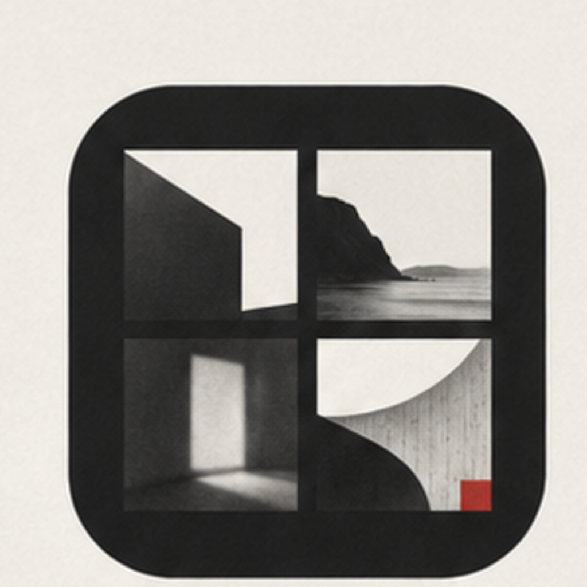
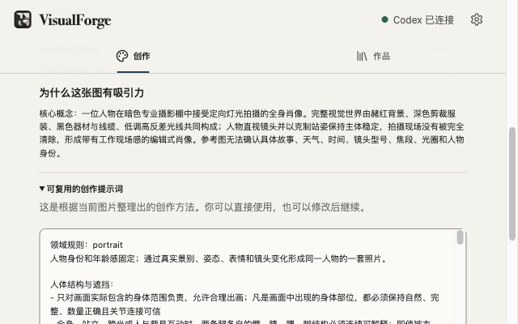
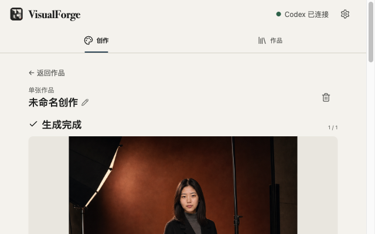

<div align="center">



# VisualForge

[简体中文](README.md) · **English**

Turn images you love into work of your own.

[](LICENSE)
[](INSTALL.en.md)
[](https://github.com/dososo/visualforge/releases/latest)
[](https://github.com/dososo/visualforge/releases/latest)
[](#how-it-works)

</div>

> VisualForge is a Chrome side-panel extension connected to your local Codex installation. Capture a visual you like, let VisualForge understand its composition, light, color, materials, camera, and mood, then replace the person or product with your own references and create a single image, a photo set, or a grid.

<div align="center">
  
  <br><sub><b>Start with a visual you love</b> — upload, paste, or use VisualForge on a web image</sub>
</div>

## What VisualForge is

VisualForge has two parts:

- **Chrome side-panel extension** — capture references, review the analysis, choose a person or product, and manage results.
- **Local Native Host** — securely connects the extension to your signed-in Codex installation and its image-generation capability. No separate API key is required.

It is not a cloud asset library and does not publish your work. There is no VisualForge account, advertising, telemetry, or central server; project records stay in your browser by default.

## What it can do

- **Understand a reference** — composition, shot size, action, expression, lighting, palette, materials, mood, and finishing.
- **Replace the subject** — the reference controls how the picture is made; your person or product references control who or what appears.
- **Create one image or a set** — single images, 2／3／4／6／9／12-shot sets, plus local grid composition.
- **Review and revise per image** — keep candidates, quality guidance, and the final selection without restarting the whole project.
- **Keep control local** — works, subject assets, generation records, and provenance remain under your control.

<div align="center">
  
  <br><sub><b>Understand first, generate second</b> — separate visual facts, creative method, and the subject to replace</sub>
</div>

<br>

<div align="center">
  
  <br><sub><b>Results stay with the project</b> — inspect, select, revise, or export</sub>
</div>

## Why VisualForge

When an image catches your eye, the hard part is not writing “make something similar.” It is understanding why the image works: where the subject sits, how far the camera is, where the light comes from, whether the action is physically believable, and how color and texture create its character.

VisualForge keeps that complexity inside the system and makes the user flow simple:

> **Pick a visual → replace the subject → create your version.**

## Design principles

- **Reference first** — preserve observable visual decisions before introducing variation.
- **Clear responsibilities** — the reference controls the visual method; person and product assets control identity and structure.
- **The user decides** — quality checks are guidance. They never silently discard a valid image or trigger hidden regeneration.
- **Complexity stays inside** — advanced controls are folded away; every step has one clear primary action.
- **Local-first and traceable** — no VisualForge cloud account; references, revisions, and final selections remain inspectable.

## Get started in three steps

See the complete [minimal install guide](INSTALL.en.md).

1. Download one package for your operating system from [Releases](https://github.com/dososo/visualforge/releases/latest), then run its installer.
2. Extract `VisualForge-extension.zip`, open `chrome://extensions`, enable Developer mode, and choose “Load unpacked.”
3. Open VisualForge and click “Check connection again” in Settings. You are ready when it says “Codex connected.”

> Codex must already be installed and signed in. The macOS package is Universal for Apple Silicon and Intel; Windows and Linux packages currently target x64.

## How it works

```text
Web image or uploaded reference
              ↓
Chrome Side Panel: capture, edit, local project management
              ↓ Native Messaging
VisualForge local Native Host
              ↓ local Codex App Server
Visual understanding and imagegen generation
```

VisualForge does not copy Codex credentials, require an API key, or run its own image-generation server. Your selected images and instructions are sent to your signed-in Codex／OpenAI service only after you explicitly start analysis or generation.

## Build from source

Requires Node.js 22+, pnpm 10+, Chrome 116+, and an installed, signed-in Codex.

```bash
git clone https://github.com/dososo/visualforge.git
cd visualforge
pnpm install --frozen-lockfile
pnpm typecheck
pnpm test
pnpm build
pnpm setup:host
```

The extension output is `apps/extension/.output/chrome-mv3/`. This is a pnpm workspace: the WXT＋React＋TypeScript extension lives in `apps/extension/`, the Node Native Messaging Host in `apps/native-host/`, and shared contracts and creation logic in `packages/`.

## Privacy and boundaries

- No VisualForge central server, account, advertising, or telemetry.
- Selected images and instructions reach your signed-in Codex／OpenAI service only when you explicitly analyze or generate.
- Only use references and subject assets you have the right to process. Do not use VisualForge to impersonate people or create non-consensual sensitive content.
- The macOS 0.5.8 Universal package is Developer ID signed, Apple-notarized, and stapled. Windows and Linux limits are stated clearly in the Release until target-system signing and continuous acceptance are complete.

See [Privacy](PRIVACY.md), [Security](SECURITY.md), and [Contributing](CONTRIBUTING.md).

## License

[Apache License 2.0](LICENSE) © 2026 爆裂队长 NEXT (BLCaptain)

## Author

**爆裂队长 NEXT (BLCaptain)**

- GitHub: [dososo](https://github.com/dososo)
- X: [@thinkszyg](https://x.com/thinkszyg)
- Email: blteam2026@outlook.com

<div align="center"><sub>© 2026 爆裂队长 NEXT · VisualForge — turn visuals you love into work of your own.</sub></div>
